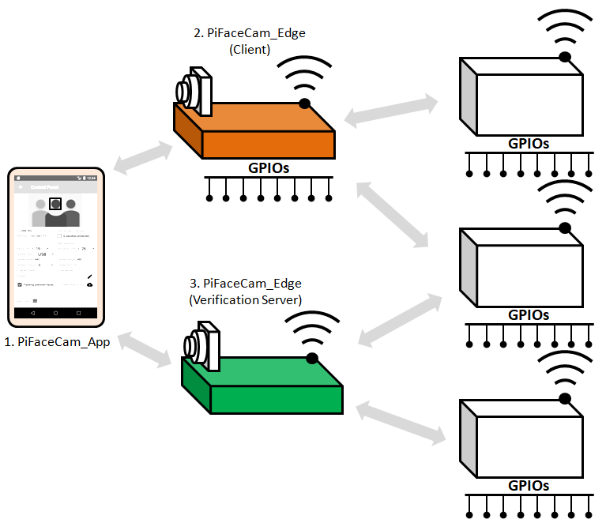

**Downloads:**
* Complete user guide:[PiFaceCam User Guide V2_2.pdf](https://github.com/tensorfactory/PiFaceCam/tree/master/downloads)
* PiFaceCam-App Community (Free from Google Play):[PiFaceCam Community](https://play.google.com/store/apps/details?id=com.tensorfactory.pifacecamcommunity)
* * PiFaceCam-App Professional (Purchase from Google Play):[PiFaceCam Professional](https://play.google.com/store/apps/details?id=com.tensorfactory.pifacecamprofessional)
* Image of SD Card (Raspbian Buster desktop + necessary libraries):[2020-02-13 buster with base libraries for pifacecam.7z](https://drive.google.com/open?id=1SMEC0KdPjZMuGqKpISzrndNxZqUjkP63)

## PiFaceCam
### Facial Recognition for Raspberry Pi

#### Overview
PiFaceCam system uses deep neural network for high accuracy facial recognition. It is designed to run efficiently in Raspberry (Pi3 Model B+ and Pi4). PiFaceCam system consists of 3 components. 
 
1. PiFaceCam_Edge Client: Runs in Raspberry Pi* with camera(s) attached. It performs facial recognition and can be programmed to carry out instructions using simple scripts. It can also be programmed to send facial data to other devices.
2. PiFaceCam_Edge Verification Server:  Runs in Raspberry Pi* with camera(s) attached.  It acts as verification server where clients send images for verifications.  It compares the faces in received images with those detected in front of the camera(s) and return the verification results to clients.
3. PiFaceCam_App: Runs in Android devices (currently only support android devices). It is for managing and controls all PiFaceCam edge devices connected through local network. 

**Features:**
* Facial recognition based on assigned face ids and carry instruction per scripts.
* Supports stereo camera setup where 2 cameras (1 Picamera + 1 USB camera) are used to capture images of a person at different angles, as a layer of security against simple photo attack.
* Comprehensive tools for collecting, editing and organizing face ids.
* Simple scripting concept for automation.
* User-friendly tools to create, edit and manage scripts/programs.
* Remote monitor, manage and control multiple devices.
* Built-in functions to control GPIOs, communicate with JSON-server and sending out emails.

Note: Please read user guide: [PiFaceCam User Guide V2_2.pdf](https://github.com/tensorfactory/PiFaceCam/tree/master/downloads) for more information.

**Install:**

**(PiFaceCam-Edge)**

This PiFaceCam-Client was developed for Raspbian Buster with desktop (Kernel version: 4.19).  You will need the following supporting libraries.
1.	Pyhton3 (developed using version 3.7.3)
2.	Tensorflow 1.X  (developed using version 1.15)
3.	OpenCV for python (developed using version 4.2.0)
4.	Scikit-learn (developed using version 0.22)
5.	Pycryptodomex  (developed using version 3.9.6)

After you have installed all the necessary libraries, copy all the files from ["pifacecam_edge" folder at github](https://github.com/tensorfactory/PiFaceCam/tree/master/pifacecam_edge) .

*If you don't want to go through all the trouble of installing all the necessary components, we are sharing out SD Card's image file at github as well. Please take note that we are using 16GB SD Card, therefore you will need a larger memory card to flash the image. After flashing your SD Card, remember to reclaim the missing disk space by running raspi-config -> Advanced Options -> Expand Filesystem Ensures that all of the SD card storage is available.
*

**Run:**

1) Connect GPIO 19 to LED via a resistor and GPIO 26 to ground via a resistor.

2) $ python3 wrapper.py

The LED will start to blink indicating system loading. When successfully loaded and ready, the LED will continuously ON. Connecting GPIO 26 to HIGH will trigger system shutdown.

Note: Follow step 1 in section 4.1 of "userguide" to setup PiFaceCam edge devices to auto-start when power ON.

**(PiFaceCam-App)**

Requires Android OS Marshmallow and above. The device will require network connection to communicate with PiFaceCam edge devices. It allows you to control and manage all connected PiFaceCam edge devices.

(Versions)

There are 2 versions of PiFaceCam_App, PiFaceCam (Community) and PiFaceCam (Professional). Community version is free and professional version is paid. Both can be download from Google Play store.

**(Features)**

| Features                                | Community     | Professional |
| --------------------------------------- | ------------- | ------------ |
| Create and manage scripts / programs.   | Yes           | Yes          |
| Create and manage face ids.             | Limited to 20 | Not limited  |
| Setting and manage of attached cameras. | Yes           | Yes          |
| Setting facial recognition criteria.    | Yes           | Yes          |
| Enabling face verification server mode. | No            | Yes          |

Note: Please read user guide: [PiFaceCam User Guide V2_2.pdf](https://github.com/tensorfactory/PiFaceCam/tree/master/downloads) for more information.