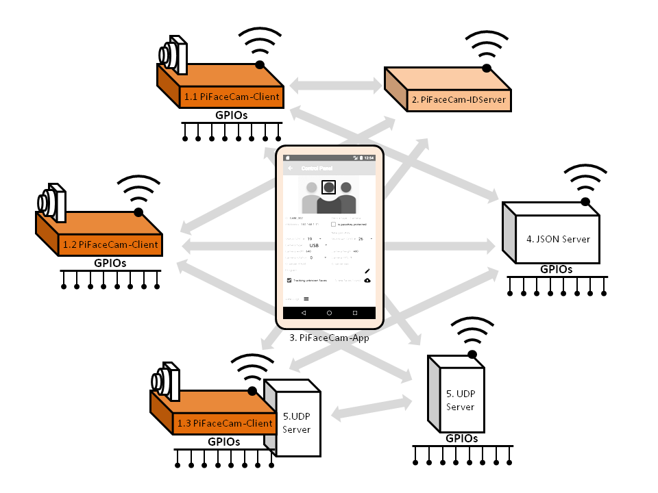

**Downloads:**
* Complete user guide:[PiFaceCam User Guide V1_3.pdf](https://github.com/tensorfactory/PiFaceCam/tree/master/downloads)
* PiFaceCam-App Community (Free from Google Play):[PiFaceCam Application](https://play.google.com/store/apps/details?id=com.tensorfactory.pifacecamcommunity)
* Image of SD Card (Raspbian Buster desktop + necessary libraries + PiFaceCam-IDServer + PiFaceCam-Client):[2019-09-26 buster with base libraries and pifacecam 1.3.11.img.7z](https://drive.google.com/drive/folders/17RT4cYmYMQs3T3JijVTyo2ctESoDOa-v?usp=sharing)

## PiFaceCam
### Facial Recognition for Raspberry Pi

#### Overview
PiFaceCam system uses deep neural network for accurate facial recognition. It is designed to run efficiently in Raspberry Pi (tested in Pi3 Model B+ and Pi4 Model B 4GB) at 10~11FPS (based on single face and running on Pi4 B).
PiFaceCam currently consists of 3 components (which collectively known as PiFaceCam system). 
1. PiFaceCam-Client: Runs in Raspberry Pi with camera attached. It performs facial recognition, carries out instructions as per the uploaded program and also capable to conveys data to other components.
2. PiFaceCam-IDServer (Optional):  Runs in Raspberry Pi. It allows synchronization for face ids among multiple PiFaceCam-Clients (More will be explained at the implementation section).
3. PiFaceCam-App(Controller): runs in Android devices (currently only support android devices). It is for managing all PiFaceCam-Clients connected through local network. It is responsible for;
	* 	  setting and monitor PiFaceCam-Clients.
	* 	  create and manage face ids.
	* 	  create/edit scripts/programs for PiFaceCam-Clients.

**Features:**
* Facial recognition based on known face ids and carry instruction per scripts.
* Auto tracking and assigning temporary ids for unknown faces (which user can later review and assign proper ids).
* Comprehensive tools for collecting, editing and organising face ids.
* 10 levels of detection sensitivity adjustment to accommodate all types of application conditions.
* Simple scripting concept for automation.
* User-friendly tools to create, edit and manage scripts/programs.
* Remote monitor, manage and control multiple devices.
* Built-in functions to control GPIOs, communicate with JSON-server and sending emails.
* Expose raw information (image, detected face-ids and face bounding boxes) via UDP socket for unrestricted capability extension.

Note: Please read user guide: [PiFaceCam User Guide V1_3.pdf](https://github.com/tensorfactory/PiFaceCam/tree/master/downloads) for more information.

**Install:**

**(PiFaceCam-Client)**

This PiFaceCam-Client was developed for Raspbian Buster with desktop (Kernel version: 4.19).  You will need the following supporting libraries.
1.	Pyhton3 (developed using version 3.7.3)
2.	Tensorflow 1.X  (developed using version 1.15)
3.	OpenCV for python (developed using version 4.2.0)
4.	Scikit-learn (developed using version 0.22)
5.	Pycryptodomex  (developed using version 3.9.4)

After you have installed all the necessary libraries, copy all the files from ["pifacecam_client" folder at github](https://github.com/tensorfactory/PiFaceCam/tree/master/pifacecam_client) .

*If you don't want to go through all the trouble of installing everything yourself, we are sharing out SD Card's image file at github as well. Please take note that we are using 16GB SD Card, therefore you will need a large card to flash the image.
After flashing your SD Card, remember to reclaim the missing disk space by running raspi-config -> Advanced Options -> Expand Filesystem Ensures that all of the SD card storage is available. PiFaceCam_Client's files are placed in "home/pi" folder.*

**Run:**

1) Connect GPIO 19 to LED via a resistor and GPIO 26 to ground via a resistor.

2) $ python3 wrapper_without_UDP_server.py

The LED will start to blink indicating system loading. When successfully loaded and ready, the LED will continuously ON. Connecting GPIO 26 to HIGH will trigger system shutdown.

Note: Follow step 1 in section 5.1 of "userguide" to setup PiFaceCam-Client to auto-start when power ON.

**(PiFaceCam-IDServer)**

This PiFaceCam-IDServer was developed for Raspbian Buster with desktop (Kernel version: 4.19) and requires the following supporting libraries.
1.	Pyhton3 (developed using version 3.7.3)
2.	Scikit-learn (developed using version 0.22)
3.	Pycryptodomex  (developed using version 3.9.4)

After you have installed all the necessary libraries, copy all the files from ["pifacecam_idserver" folder at github](https://github.com/tensorfactory/PiFaceCam/tree/master/piface_cam_idserver) .

*Similarly, all these files are included in the SD Card image file that we are sharing out at github. PiFaceCam_IDServer's files are placed in "home/pi" folder.*

**Run:**

1) Connect GPIO 19 to LED via a resistor and GPIO 26 to ground via a resistor.

2) $ python3 wrapper.py

The LED will start to blink indicating system loading. When successfully loaded and ready, the LED will continuously ON. Connecting GPIO 26 to HIGH will trigger system shutdown.

Note: Follow step 1 in section 5.1 of "userguide" to setup PiFaceCam-IDServer to auto-start when power ON.

**(PiFaceCam-App)**

PiFaceCam-IDServer requires Android OS Marshmallow and above. There are 2 versions of PiFaceCam-App.  PiFaceCam (Community) and PiFaceCam (Professional).  The community version is free, has all the features but the number of face ids it can store or handle limited to 20. Both versions can be obtained from Google Play.

